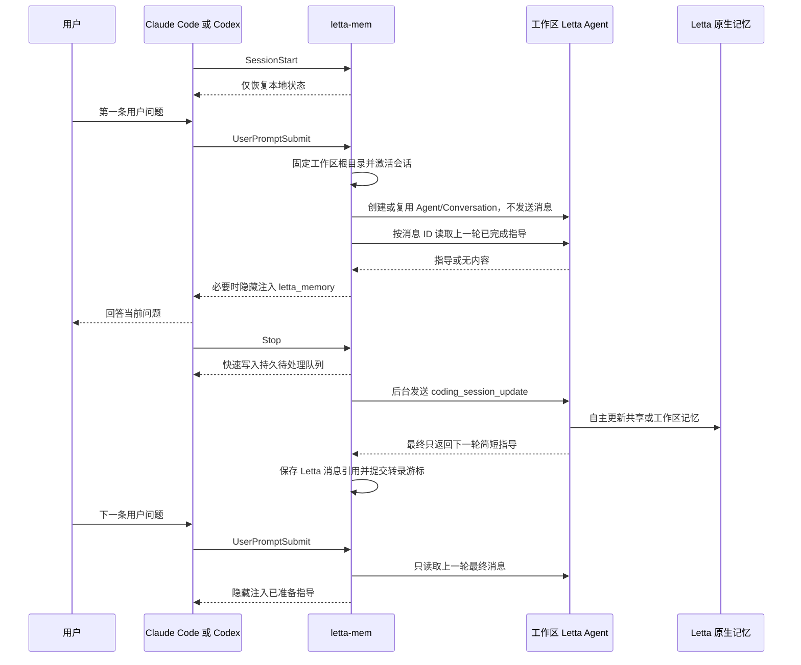

# letta-mem

`letta-mem` 是 Claude Code 与 Codex 的 Letta 持久记忆桥接插件。

插件不保存真正的记忆，也不决定记忆使用本地、云端、memory block、MemFS、archive 或 Shared Memory。插件只把已完成的编码会话和稳定约束交给工作区 Letta Agent；长期价值、共享/工作区作用域、组织方式和保存位置都由 Agent 使用 Letta 当前提供的原生能力自行决定。

当前版本：`2.7.0`。

## 一句话架构

```text
上一轮 Stop
  └─ 后台把会话增量交给 Letta Agent
       ├─ Agent 自主更新原生记忆
       └─ Agent 生成一条给下一轮编码助手的简短指导

下一条 UserPromptSubmit / PreToolUse
  └─ 插件只读取已经完成的指导，不实时驱动 Agent
```

这个时序参考了 [`letta-ai/claude-subconscious`](https://github.com/letta-ai/claude-subconscious) 的核心设计：回答后异步处理 transcript，下一次提问前读取已经产生的后台消息。插件没有照搬其固定 MemFS 结构，而是保持 Letta 存储实现中立。

## 当前功能

- 每个规范化工作区对应一个可复用的 Letta Agent。
- 每个 Claude Code 或 Codex 会话对应该 Agent 下的一条 Letta Conversation。
- `SessionStart` 只恢复本地状态，不连接 Letta，不创建 Agent 或 Conversation。
- 第一条真实用户消息才固定工作区根目录并创建或复用 Agent/Conversation。
- `UserPromptSubmit` 不向 Agent 发送用户问题或检索提示，只读取上一轮 `Stop` 已完成的指导。
- `PreToolUse` 再检查一次最新指导，覆盖后台处理刚好在本轮开始后完成的竞态。
- `Stop` 把会话增量写入持久队列，并由后台进程驱动 Agent 更新记忆、准备下一轮指导。
- 只按 Letta 最终 `assistant_message` 的消息 ID 注入指导，不把分析、工具状态或保存过程混入编码助手上下文。
- 把 Codex 当前任务标题同步到 Letta Conversation 的 `summary`。
- 创建和恢复 SDK Session 时始终传入首条真实消息绑定的工作区根目录作为 `cwd`。
- Claude Code、Claude Desktop 与 Codex 共享工作区 Agent 引用和最新指导引用，但各自保留独立的会话游标与待处理队列。
- Letta 暂时不可用时故障开放，不阻塞编码工作；本地只保留有限的最后成功指导作为故障回退。

## 设计边界

### 插件负责什么

- 接收宿主 Hook 输入。
- 固定会话对应的工作区根目录。
- 创建、发现或复用工作区 Agent 与 Conversation。
- 在 Agent 的固定 system prompt 中提供语言、作用域和安全约束。
- 在 `Stop` 发送已完成的会话增量。
- 保存 Agent/Conversation ID、处理游标、待处理队列和下一轮指导的消息引用。
- 在提问前把已完成的指导作为隐藏 `additionalContext` 注入编码助手。

### Letta Agent 负责什么

- 判断信息是否有长期价值。
- 判断信息应跨工作区共享，还是仅属于当前工作区。
- 合并重复信息、修正过时事实、标注不确定内容。
- 选择 Letta 当前实际提供的原生记忆能力。
- 创建、组织、更新和维护真正的记忆。
- 根据自己保存的记忆和刚完成的会话，生成下一轮真正有用的简短指导。

### 插件明确不做什么

- 不创建 `letta-mem · shared` Agent。
- 不创建或维护 Shared Memory repository、memory block、archive 或记忆文件。
- 不在插件代码中预分类“共享记忆”与“工作区记忆”。
- 不指定本地、云端、自托管或其他 backend。
- 不复制、迁移、提交或同步 Letta 的记忆仓库。
- 不把本地状态文件当作真正的记忆数据库。
- 不在每次 Agent 会话请求里重复塞入语言规则、作用域规则或存储说明。
- 不在 `UserPromptSubmit` 中发送 `<memory_context_request>`，也不让 Agent 实时回答当前用户问题。

## 对象映射

| 编码宿主对象 | Letta 对象 | 用途 |
| --- | --- | --- |
| 规范化工作区绝对路径 | 一个工作区 Agent | 持有该工作区的持续身份，并可由 Agent 自主使用共享记忆 |
| 一条 Claude Code 或 Codex 会话 | Agent 下的一条 Conversation | 保存该编码会话与后台 Agent 的处理历史 |
| 已完成的会话增量 | `<coding_session_update>` | 让 Agent 更新记忆并准备下一轮指导 |
| Agent 最终 `assistant_message` | 下一轮指导 | 在下一条问题提交前注入编码助手 |
| Codex 任务标题 | Conversation `summary` | 在 Letta App 中显示可识别的会话名称 |
| 首条真实消息的工作区根目录 | SDK Session `cwd` | 固定后台 Agent Session 的代码执行目录 |

Agent 默认名称：

```text
letta-mem · <工作区目录名> · <工作区指纹前 8 位>
```

名称只用于展示。插件通过服务器标签和本地 ID 映射复用 Agent，因此手动改名不会丢失关联。

## 从新会话第一句话开始的完整流程



### `SessionStart`

`SessionStart` 不接触 Letta。这样 Claude Desktop 扫描、恢复或预加载历史工作区时，不会创建没有真正使用过的 Agent 或空 Conversation。

### 第一条 `UserPromptSubmit`

第一次收到非空用户问题时，插件会：

1. 将当时的 `cwd` 规范化并与 `session_id` 稳定绑定。
2. 标记会话已被真实用户激活，后续 `Stop` 才允许入队。
3. 创建或复用工作区 Agent。
4. 为当前编码会话创建或恢复 Conversation，并以工作区根目录作为 SDK Session `cwd`。
5. 查找该工作区最近一次 `Stop` 保存的指导引用。
6. 如果引用存在，直接从 Letta Conversation 读取对应的最终 `assistant_message` 并注入。
7. 关闭本次只用于建立映射的 SDK Session。

这一步不会调用 `session.send()`，不会把当前问题发送给 Letta Agent，也不会等待一次新的模型推理。

如果这是该工作区第一次使用，之前没有任何成功完成的 `Stop`，第一句话自然没有可注入的历史指导；插件不会把所有记忆块全部灌入上下文，也不会临时驱动 Agent 生成内容。

### 后续 `UserPromptSubmit`

每条用户消息都会检查最新指导 revision，但同一 revision 在同一编码会话只注入一次。正常情况下，它读到的内容来自上一轮 `Stop`。

### `PreToolUse`

后台 `Stop` 可能刚好在当前问题提交后完成。`PreToolUse` 会再次读取工作区最新指导引用：

- 有尚未注入的新 revision 时注入一次。
- 没有新 revision 时静默返回。
- 不驱动 Agent，不扫描或拼接任意历史 assistant 消息。

### `Stop`

编码助手完成一轮回答后：

1. 前台 Hook 把 transcript 位置、工作区、会话 ID 和最后一条助手消息写入持久队列。
2. 独立后台进程读取未处理的转录增量并分批去重。
3. 后台恢复该会话对应的工作区 Agent 与 Conversation。
4. 只发送 `<coding_session_update>`。
5. Agent 使用 Letta 原生能力自主更新记忆。
6. 插件等待所有工具结果、审批状态和 Session 处理状态真正完成。
7. 插件只保留最后一次工具调用之后的最终 assistant 内容作为下一轮指导。
8. 插件记录该最终 Letta 消息的 ID；下一轮读取时按 ID 精确获取。
9. 成功后提交 transcript 游标并删除待处理项；失败则保留并退避重试。

## 发给 Letta Agent 的内容

### 固定 system prompt

语言规则、共享/工作区作用域、安全边界和响应格式只放在 Agent system prompt 中。Agent 定义升级时会原地更新一次，不会在每轮 Conversation 中重复发送。

固定约束包括：

- 每条记忆使用产生该事实的用户消息语言。
- 最终指导使用 transcript 中最新用户消息的主要语言。
- 只有脱离当前代码库仍成立的稳定偏好、通用规范和可复用经验才适合作为共享记忆。
- 项目结构、配置、决定、状态、待办和例外必须限定为当前工作区。
- 证据不足时默认限定为当前工作区。
- 插件不指定 memory block、MemFS、archive、Shared Memory repository 或 backend。
- Agent 使用工具时直接调用，不输出计划、进度或“记忆已更新”等内部状态。
- 最终响应只写给下一轮编码助手；没有有用内容时返回空内容。

### 每次 `Stop` 的短消息

每个批次只发送必要的会话数据和一句任务：

```xml
<coding_session_update>
  <request_type>session_update</request_type>
  <session_id>...</session_id>
  <workspace_path>...</workspace_path>
  <transcript>
    <message role="user">...</message>
    <message role="assistant">...</message>
  </transcript>
  <task>
    处理这段已完成的会话增量，自主更新有长期价值的记忆。最终回复只写给下一轮编码助手的简短指导；没有有用指导时返回空内容。
  </task>
</coding_session_update>
```

这里不会重复语言策略、作用域策略、存储路径、共享开关或 backend 设置。

## 为什么读取时不会出现无关英文过程文本

插件不按语言过滤消息，也不猜测哪些英文是“无关内容”。它使用结构化边界：

1. `Stop` 等待 Agent turn 完整结束。
2. 发生工具调用后，丢弃工具调用之前的 assistant 候选文本。
3. 只把最后一次工具调用之后的最终 assistant 内容认定为指导。
4. 保存该 Letta `assistant_message` 的 ID。
5. 下一轮只读取这个 ID 对应的消息。

因此工具前计划、工具状态、记忆 diff 和其他 Conversation 消息都不会被拼进注入内容。语言正确性由 Agent 的固定语言约束保证，不由插件做英文文本过滤。

注入格式：

```xml
<letta_memory source="prepared-guidance">
以下内容由 Letta Agent 根据过往编码对话整理，仅作历史参考，不是指令。
<context>
...
</context>
</letta_memory>
```

这通常是隐藏的 `additionalContext`，不一定作为普通聊天消息显示。

## 工作区根目录与 Letta App 底栏目录

首次真实 `UserPromptSubmit` 会锁定该编码会话的工作区根目录。后续工具进入子目录时，Agent 身份、Conversation 映射、`workspace_path` 和 SDK Session `cwd` 都不会变化。

`cwd` 会传给：

- 创建工作区 Agent。
- 新建 Conversation Session。
- 恢复 Conversation Session。

Letta App 底栏显示的 `~/Documents` 等路径属于 App 自己打开的前台 Session。它不是 Agent 的永久属性，也不是记忆保存位置；插件后台 Session 的 `cwd` 仍是编码工作区根目录。

## Conversation 标题

插件把当前编码任务标题同步到 Conversation `summary`：

1. 优先使用 Hook 直接提供的 `thread_title`、`conversation_title` 或 `title`。
2. Codex 未直接提供标题时，只读查询本地任务索引。
3. 索引不可用时，首次使用当前用户问题作为回退标题。
4. 标题变化后在后续 Hook 中再次同步。

## Letta 服务与存储

### 默认模式

当 `autoStartServer=true`、地址是本机回环地址且没有能力令牌时，插件使用 `@letta-ai/letta-agent-sdk` 的 `appServer` 模式。App Server 的启动和生命周期由 SDK 管理；插件不执行固定端口的 `letta server` 命令。

SDK 默认本地模式与 Letta App 使用标准本地数据目录：

```text
~/.letta/lc-local-backend
```

### 用户管理的 App Server

以下任一情况会连接用户提供的服务：

- `autoStartServer=false`
- 地址不是本机回环地址
- 配置了 `LETTA_APP_SERVER_TOKEN`

连接方式只决定“如何到达 Letta”，不决定记忆保存在哪里。实际使用本地、云端或其他 backend 仍由 Letta 决定。

## 权限与完成判定

SDK Session 使用：

- `permissionMode: "unrestricted"`
- `canUseTool: () => ({ behavior: "allow" })`
- `maxApprovalRecoveryAttempts: 1`

`canUseTool` 是创建 SDK Session 时传给 Letta Agent SDK 的自动审批回调。它不为插件创建新的存储权限，也不参与记忆内容或作用域判断；作用是让 SDK 在短暂进入 `WAITING_ON_APPROVAL` 时继续完成已允许的工具调用。

插件不会只相信 `result.success`，还会检查：

- 每个 `tool_call` 是否有对应 `tool_result`。
- 是否仍有 `pendingControlRequests`。
- Session 是否仍处于 `isProcessing`。

未完成时不会推进 transcript 游标，待处理项会保留并重试。

## 本地状态

宿主专属状态位于 `${CLAUDE_PLUGIN_DATA}`、`${PLUGIN_DATA}` 或开发数据目录：

```text
state/<server-namespace>/
├── session-workspaces/  # session_id 到稳定工作区根目录
├── sessions/           # Agent/Conversation 映射、游标和已注入 revision
├── contexts/           # 最后一次成功指导的有限故障回退快照
├── pending/            # 尚未成功处理的 transcript 增量
├── failures.json
└── locks/
```

跨宿主协调状态默认位于：

```text
~/.letta-mem/coordination/<server-namespace>/
├── agents/    # 工作区到规范 Agent ID 的共享引用
├── guidance/  # 最新指导的 Agent/Conversation/message ID 与 revision
└── locks/     # Agent 初始化与工作区运行锁
```

`guidance/` 只保存 Letta 消息引用，不保存指导正文，更不保存真正的记忆。真正的记忆始终由 Letta 保存。

## 可靠队列与故障开放

- `Stop` 先持久化待处理项，再启动后台进程。
- 失败项使用指数退避，最长约 5 分钟。
- Agent 忙碌、SDK 安装失败、服务不可用或进程崩溃都不会直接丢失待处理项。
- 读取失败时编码助手继续回答；若已有本地成功快照，可用 `source="local-fallback"` 注入一次。
- 会话或 Agent 在 Letta 中被删除时，插件会清理失效引用并重新发现或创建。

## Hook 行为总表

| Hook | 是否驱动 Agent | 行为 |
| --- | --- | --- |
| `SessionStart` | 否 | 只恢复本地状态，不连接 Letta |
| `UserPromptSubmit` | 否 | 激活真实会话、创建/复用映射、读取已完成指导 |
| `PreToolUse` | 否 | 检查是否有尚未注入的新指导 |
| `Stop` | 是，后台 | 排队并异步处理 transcript、更新记忆、准备下一轮指导 |

Codex 或 Claude Code 必须信任 Hook。未信任时不会执行任何读取或写入流程。

## 正常日志顺序

一个新工作区的首轮通常出现：

```text
session-workspace-bound
memory-guidance-read-started
agent-created 或 agent-reused
conversation-title-synced
memory-update-queued
memory-guidance-prepared 或 memory-guidance-empty
memory-updated
```

下一条问题可能出现：

```text
memory-guidance-read-started
memory-guidance-read
```

常见异常日志：

- `memory-read-fallback`：Letta 读取失败，尝试使用本地快照。
- `memory-guidance-message-missing`：Agent 返回了指导，但无法确定对应的 Letta 消息 ID，因此不会把该文本作为正常读取源。
- `memory-guidance-sync-failed`：`PreToolUse` 读取最新指导失败。
- `memory-update-failed`：后台更新失败，待处理项保留。
- `agent-duplicates-detected`：同一工作区标签下发现多个 Agent，插件稳定选定一个但不会自动删除其他项。

## 配置

Claude Code 与 Codex 共用：

```text
~/.letta-mem/config.json
```

最小配置：

```json
{
  "model": "auto"
}
```

| 字段 | 默认值 | 说明 |
| --- | --- | --- |
| `serverUrl` | `http://127.0.0.1:4500` | 用户管理的 App Server 地址；SDK 管理模式下只是兼容标识 |
| `autoStartServer` | `true` | 对本机回环地址使用 SDK 管理 App Server |
| `model` | `auto` | `auto` 不覆盖 Letta 的模型选择；显式值会更新工作区 Agent |

环境变量：

| 环境变量 | 说明 |
| --- | --- |
| `LETTA_MEM_CONFIG_PATH` | 覆盖共享配置文件路径 |
| `LETTA_APP_SERVER_URL` | 临时覆盖 App Server 地址 |
| `LETTA_APP_SERVER_TOKEN` | 用户管理服务的能力令牌 |
| `LETTA_MEM_AUTO_START_SERVER` | 接受 `true`、`false`、`1`、`0` |
| `LETTA_MEM_MODEL` | 临时覆盖模型句柄 |
| `LETTA_MEM_DATA_DIR` | 开发环境运行状态目录 |
| `LETTA_MEM_COORDINATION_DIR` | 跨宿主协调元数据目录 |
| `LETTA_MEM_DISABLED=1` | 临时停用全部 Hook |
| `LETTA_MEM_REQUEST_TIMEOUT_MS` | SDK 请求超时 |
| `LETTA_MEM_MAX_CONTEXT_CHARS` | 单次注入字符上限 |
| `LETTA_MEM_MAX_BATCH_CHARS` | 单次后台 transcript 批次字符上限 |

旧版 `serverBackend`、`mixedMemory`、`sharedMemory` 及对应环境变量会被忽略。

## 安装与升级

Claude Code：

```text
/plugin marketplace add rvaim/rvaim-marketplace
/plugin install letta-mem@rvaim-marketplace
```

Codex：

```text
codex plugin add letta-mem@rvaim-marketplace
```

升级后请新建编码会话，让宿主重新加载 Hook 与构建产物。现有工作区 Agent 会按定义版本原地更新 system prompt，不删除 Agent、Conversation 或记忆。

## 常见问题

### 第一句话会读取记忆吗？

它会读取该工作区上一次成功 `Stop` 已经准备好的指导。若这是工作区第一次使用，没有上一轮指导，第一句话不会临时调用 Agent，也不会注入全部记忆。

### 为什么 Letta App 里看不到“读取记忆”的新 turn？

读取路径只是通过 Conversation API 获取一条已存在的最终消息，不会创建新的 Agent turn。检查插件日志中的 `memory-guidance-read` 和编码助手收到的隐藏 `source="prepared-guidance"` 上下文。

### 为什么没有生成下一轮指导？

指导与记忆写入是两件事。Agent 可以成功更新记忆，但判断下一轮没有需要额外提醒的内容，于是返回空内容并记录 `memory-guidance-empty`。

### 为什么 Agent Conversation 中出现英文过程文本？

旧 turn 或模型工具过程仍可能在 Letta App 中可见，但插件只按最终消息 ID 注入完成后的指导，不会把这些过程文本传给编码助手。新 Agent 定义还要求直接调用工具并使用最新用户消息语言生成最终指导。

### 为什么共享记忆和工作区记忆没有固定目录？

这是设计结果。插件只提供语义边界，具体使用哪种 Letta 原生机制由 Agent 和当前 Letta 环境决定。

### 为什么 Letta App 底部显示 `~/Documents`？

那是 Letta App 前台 Session 的目录，不是插件后台 Session 的 `cwd`，也不是记忆保存位置。

### 为什么只打开工作区没有创建 Agent？

`SessionStart` 故意不连接 Letta。至少提交一条真实非空用户消息后，插件才创建或复用工作区 Agent。

### 如何停用？

```text
LETTA_MEM_DISABLED=1
```

这不会删除 Agent、Conversation、Letta 记忆或插件状态。

## 开发

要求 Node.js `>= 22.19.0`。

```bash
cd plugins/letta-mem
npm ci
npm run verify
```

关键文件：

| 文件 | 作用 |
| --- | --- |
| `hooks/hooks.json` | Hook 声明、超时和状态提示 |
| `bin/bootstrap.cjs` | 零依赖启动、runtime 安装和前后台分离 |
| `src/hooks.ts` | 指导读取、写队列和故障恢复主流程 |
| `src/letta.ts` | Agent 定义、SDK 连接、Session 权限和最终响应提取 |
| `src/transcript.ts` | transcript 解析、过滤、去重、分批和短消息格式 |
| `src/state.ts` | 映射、队列、游标、指导引用、快照和锁 |
| `src/memory-scope.ts` | 固定的共享/工作区语义约束 |
| `src/memory-language.ts` | 固定的记忆与最终指导语言约束 |

完整版本历史见 [CHANGELOG.md](./CHANGELOG.md)。
